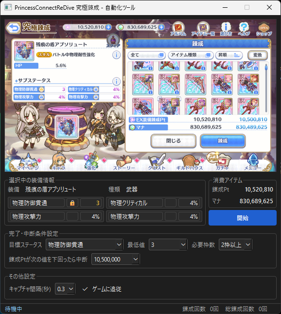

# pricone-re-synthesis

プリンセスコネクト Re:Dive「究極錬成」自動化ツール。

---

## 免責事項

- 本ツールは非公式のファンメイドツールであり、Cygames とは一切関係ありません。
- 本ツールの使用によって生じたいかなる損害・不利益（アカウント停止・データ消失・動作不良等）についても、作者は一切の責任を負いません。
- 利用は自己責任で行ってください。

---

## 動作環境

- Windows 10 / Windows 11
- プリンセスコネクト Re:Dive（DMM ゲームズ版）

---

## ダウンロード・インストール

1. [Releases](../../releases) ページから最新版の zip をダウンロードする
2. 任意のフォルダに展開する
3. フォルダ内の `ultimate-synthesis.exe` を実行する（UAC の確認が表示されたら「はい」を選択）

---

## 使い方

1. ゲームを起動し、究極錬成の装備一覧画面を開く
2. ツールが装備情報を自動検出するのを待つ
3. 完了条件・中断条件を設定して「開始」ボタンを押す
4. 停止するには Esc キーまたは停止ボタンを使用する

---

## ドキュメント

- [開発環境セットアップ](docs/DEVELOPMENT.md) — DevContainer・Windows 環境構築・ローカルビルド手順
- [ステートマシン状態遷移図](docs/STATE_DIAGRAM.md) — 自動処理の内部状態遷移の詳細
