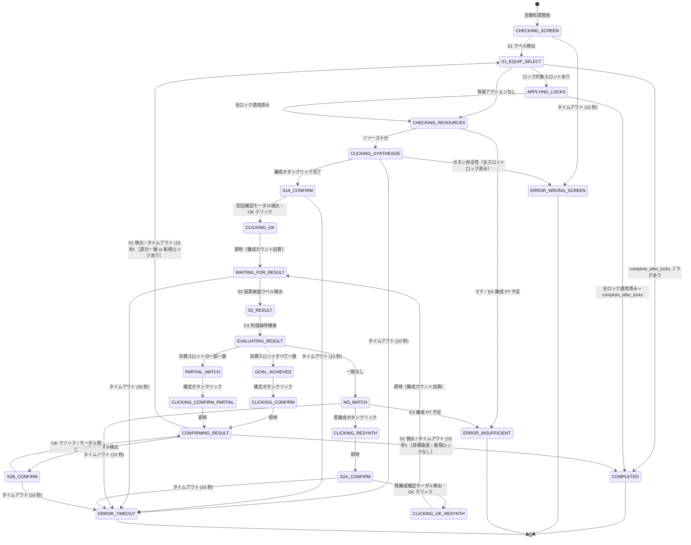

# ステートマシン 状態遷移図

`src/core/state_machine.py` に実装されているステートマシンの遷移図です。

## 遷移図

## 状態一覧

| 状態 | 説明 |
|---|---|
| `CHECKING_SCREEN` | ゲームが S1（装備選択）画面にあるかを確認する |
| `S1_EQUIP_SELECT` | S1 画面を確認済み。次のアクションを決定する |
| `APPLYING_LOCKS` | 新たに一致したサブステータス枠のロックアイコンをクリックする |
| `CHECKING_RESOURCES` | マナと EX 錬成 PT を読み取り、不足なら中断する |
| `CLICKING_SYNTHESIZE` | 錬成ボタンを検出してクリックする |
| `S1A_CONFIRM` | 初回錬成確認モーダルを待機して OK をクリックする |
| `CLICKING_OK` | 遷移状態 — 錬成カウントを加算し、待機へ移行する |
| `WAITING_FOR_RESULT` | S2 結果画面をポーリングする。アニメーション中はセーフクリックを送出する |
| `S2_RESULT` | S2 結果画面を検出済み。描画が安定するまで待機する |
| `EVALUATING_RESULT` | サブステータス名・値を取得して目標条件と照合する |
| `GOAL_ACHIEVED` | 目標スロットがすべて一致。確定ボタンをクリックする |
| `CLICKING_CONFIRM` | 遷移状態 — 即座に CONFIRMING_RESULT へ移行する |
| `PARTIAL_MATCH` | 目標スロットの一部が一致。新規一致分をロックし確定ボタンをクリックする |
| `CLICKING_CONFIRM_PARTIAL` | 遷移状態 — 即座に CONFIRMING_RESULT へ移行する |
| `NO_MATCH` | 一致なし。再錬成ボタンをクリックする |
| `CLICKING_RESYNTH` | 遷移状態 — 即座に S2A_CONFIRM へ移行する |
| `S2A_CONFIRM` | 再錬成確認モーダルを待機して OK をクリックする |
| `CLICKING_OK_RESYNTH` | 遷移状態 — 錬成カウントを加算し、WAITING_FOR_RESULT へ戻る |
| `CONFIRMING_RESULT` | 確定クリック後、S2b モーダルまたは S1 画面への復帰を待機する |
| `S2B_CONFIRM` | S2b「錬成結果反映」モーダル。OK クリック後に CONFIRMING_RESULT へ戻る |
| `COMPLETED` | 目標を完全達成。終端状態 |
| `ERROR_WRONG_SCREEN` | 予期しない画面またはウィンドウサイズ不一致。終端状態 |
| `ERROR_INSUFFICIENT` | マナまたは EX 錬成 PT が必要量を下回っている。終端状態 |
| `ERROR_TIMEOUT` | 期待する UI が検出されないままタイムアウト。終端状態 |

## タイムアウト一覧

| 状態 | タイムアウト | 定数名 |
|---|---|---|
| `CHECKING_SCREEN` | 10 秒 | `TIMEOUT_CHECKING_SCREEN` |
| `CLICKING_SYNTHESIZE` | 10 秒 | `TIMEOUT_BUTTON_DETECT` |
| `S1A_CONFIRM` | 15 秒 | `TIMEOUT_S1A_CONFIRM` |
| `WAITING_FOR_RESULT` | 30 秒 | `TIMEOUT_WAITING_FOR_RESULT` |
| `NO_MATCH` | 10 秒 | `TIMEOUT_BUTTON_DETECT` |
| `S2A_CONFIRM` | 10 秒 | `TIMEOUT_BUTTON_DETECT` |
| `S2B_CONFIRM` | 10 秒 | `TIMEOUT_BUTTON_DETECT` |
| `CONFIRMING_RESULT` | 15 秒（ソフト — S1 復帰を前提とする） | `TIMEOUT_CONFIRMING_RESULT` |
